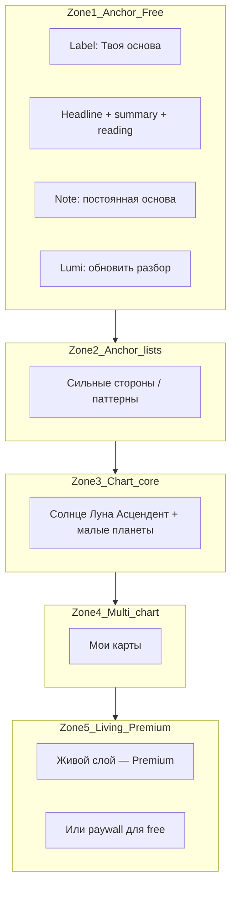

# Natal screen — information architecture

Связанные документы: [LUMIA_PRODUCT_CONSTITUTION.md](./LUMIA_PRODUCT_CONSTITUTION.md) §5, [LUMIA_CONTENT_TIER_SPEC.md](./LUMIA_CONTENT_TIER_SPEC.md).

Реализация: [views/NatalChart.tsx](../views/NatalChart.tsx).

## Цели IA

1. Пользователь понимает, что **базовый разбор (anchor)** — закреплённая основа, не «гороскоп на сегодня».
2. **Living layer** — отдельный продуктовый слой для Premium: «что активировалось сейчас», без смешения с anchor.
3. **Lumi-действие** (обновить базовый разбор за Lumi) визуально отделено от Premium living.

## Зоны экрана (сверху вниз)

| Зона | Tier | Смысл для пользователя |
|------|------|-------------------------|
| 1–2 | free (anchor) | «Кто ты в опорных чертах» — сохраняется, не подменяется living-слоем |
| 3–4 | нейтрально | Расчётные факты карты и навигация по картам |
| 5 | premium | «Что в тебе сейчас в приоритете» — тема периода, сила, уязвимость, отношения, деньги |

## Соответствие API

- Anchor: `GET/POST /api/content/natal/anchor` — `accessTier: free`, `contentVariant: anchor`.
- Living: `GET/POST /api/content/natal/living` — `accessTier: premium`, `contentVariant: living`.
- Обновление anchor за Lumi: `/api/astrology/refresh-natal-intro` (точечное действие, не путать с living).

## Copy-принципы

- Явно: база **не обновляется сама**; living про **текущий период** (Premium).
- Кнопка обновления базы формулируется как действие за Lumi, не как «ещё один гороскоп».
